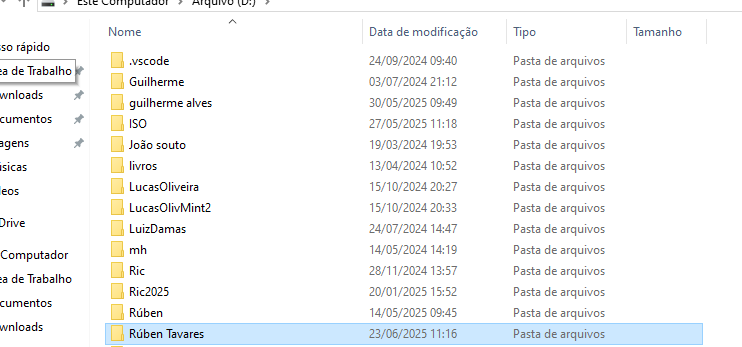
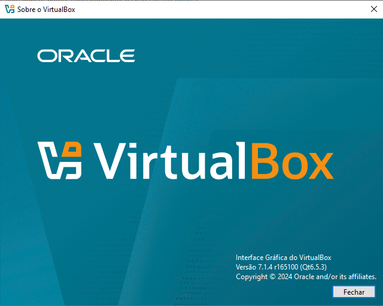
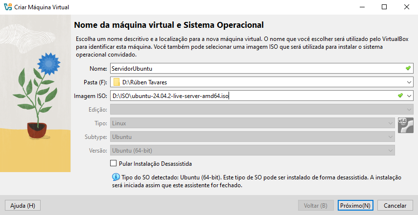
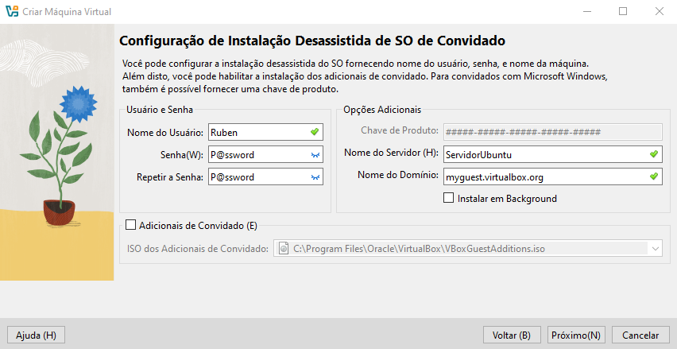
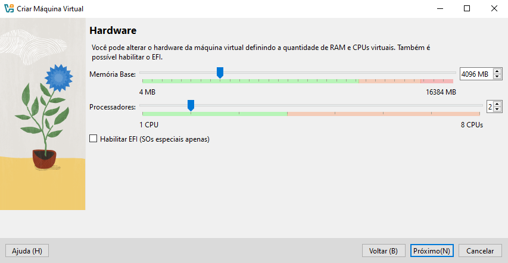
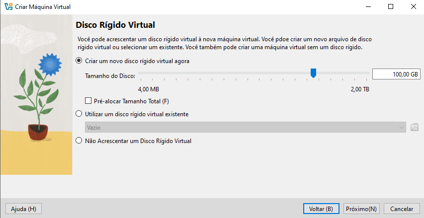
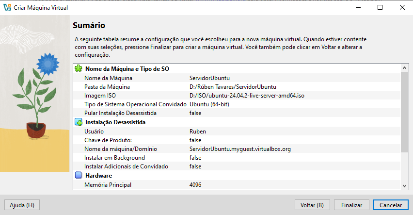
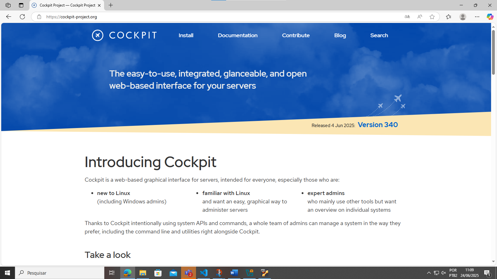

# Preparação de ambiente
Criar uma máquina virtual para instalar as ferramentas e dependências para o 
estudo de algoritimo e lógica de programação

## Criar o diretório base
Vamos criar um diretório para guardar a nossa máquina virtual. Será criado no
 Drive D. Nomeada com o nome do usuário

 

 ## Preparação da máquina virtual
 ### Vamos uar a ferramenta de virtualização chamada Virtual Box

 

 <a href="https://www.virtualbox.org/wiki/Downloads"> Faça o download aqui</a>


 ## Criando a máquina virtual 

  

Selecione a sua pasta, e a imagem ISO Ubuntu, em seguida aperte "Próximo(N)"

## Próximo passo:
- Usuário: Ruben (Nome desejado)
 - Senha: P@ssword (Senha desejada)



Aperte em "Próximo(N)"

## Próximo passo: 

- Processadores: 2
 - Memória: 4096



Aperte em "Próximo(N)"

## Próximo passo: 

 - Disco: 100 GB dinamicamente alocado 

 

 Aperte em "Próximo(N)"

 ## Próximo passo: 

 

 Aperte em "Finalizar"

## Pós instalação:

Para atualizar o sistemas iremos utilizar os seguintes comandos:

```shell
sudo apt update -y
```

```shell
sudo apt upgrade -y
``` 

ou

```shell
sudo apt update -y $$ sudo apt upgrade -y
```

## Instalação do cockpit

Ferramenta para gerenciar o servidor, por meio de um 
ambiente gráfico online



#### Comando para instalar o cockpit

```shell
sudo apt install cockpit -y
```
